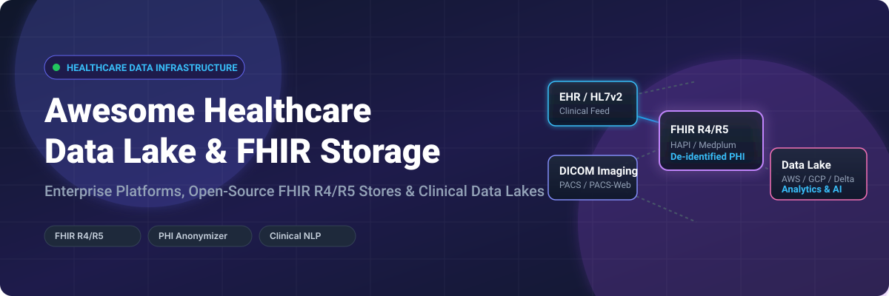

# Awesome-Healthcare-Data-Lake-Fhir-Storage

# Awesome-Healthcare-Data-Lake-Fhir-Storage 🏥 🗄️



  





  
  
  
  
  
  



---

## 🌟 Top Healthcare Data Lake & FHIR Storage Ecosystem

**Curated List of Commercial Healthcare Data Platforms & Open-Source FHIR Server Frameworks**  
*Focused on FHIR R4/R5 Storage, HL7v2/DICOM Integration, PHI De-identification, Clinical NLP, SMART on FHIR & Self-Hosted Healthcare Data Infrastructure*

**Last updated: October 2026** 📅

---

### 📌 Overview & SEO Summary
Welcome to the ultimate curated directory of **healthcare data lake platforms**, **open-source FHIR servers**, and **clinical data interoperability frameworks**. Whether you are looking for enterprise-grade commercial solutions (such as *Amazon HealthLake*, *Google Cloud Healthcare API*, and *Azure Health Data Services*), or self-hostable open-source alternatives (like *HAPI FHIR*, *Medplum*, and *Firely Server*), this list covers category leaders, FHIR storage, and privacy-respecting healthcare data infrastructure.

**Key Market Context:**
- **HAPI FHIR** is the **leading open-source FHIR server**, with **2K+ GitHub stars** and **reference implementation status** — used by **Apple Health, CMS, and thousands of healthcare organizations**.
- **Medplum** is the **leading open-source healthcare developer platform**, with **2K+ GitHub stars** and **FHIR-native APIs for building compliant healthcare applications**.
- **AWS HealthLake** is the **first HIPAA-eligible FHIR service**, providing **petabyte-scale clinical data lake with NLP-powered entity extraction** and **PHI de-identification**.

---

## 📑 Table of Contents
- [🏢 SaaS & Commercial Platforms](#-saas--commercial-platforms)
- [🔓 Open-Source GitHub Projects](#-open-source-github-projects)
- [🛠️ How to Contribute](#%EF%B8%8F-how-to-contribute)
- [📊 Star History](#-star-history)
- [🤝 Support & Sponsorship](#-support--sponsorship)
- [⚠️ Disclaimer](#%EF%B8%8F-disclaimer)

---

## 🏢 SaaS / Commercial Platforms

The healthcare data lake and FHIR storage market spans **hyperscaler healthcare APIs** (AWS HealthLake, Google Cloud Healthcare API, Azure Health Data Services) that provide **HIPAA-eligible FHIR stores with NLP and de-identification**, **health data interoperability platforms** (1upHealth, Redox, Particle Health) that focus on **connecting EHRs and payers via FHIR**, and **healthcare analytics platforms** (Innovaccer, Health Catalyst, Databricks) that offer **population health and clinical analytics**. **AWS HealthLake** charges **$0.11/GB-month for storage** and **$0.35/1,000 API calls** . **Google Cloud Healthcare API** uses **consumption-based pricing** . **Azure Health Data Services** charges **$0.10/GB-month for FHIR storage** . **1upHealth** uses **custom enterprise pricing**.

| SaaS / Commercial Platform | Company / Owner | Valuation / Market Cap | Standard Edition Starting Price | Free Tier / Free Trial Limits | Description |
| :--- | :--- | :--- | :--- | :--- | :--- |
| **[Amazon HealthLake](https://aws.amazon.com/healthlake/)** ☁️ | Amazon | ~$2.0 Trillion | **$0.11/GB-month** (storage) + **$0.35/1,000 API calls**  | **Free tier: limited** | **AWS-native healthcare data lake** — **First HIPAA-eligible FHIR service** . **Petabyte-scale clinical data lake** . **NLP-powered entity extraction** from unstructured medical text . **PHI de-identification** . **FHIR R4 compliant** . |
| **[Google Cloud Healthcare API](https://cloud.google.com/healthcare-api)** 🌐 | Google (Alphabet) | ~$2.0 Trillion | **Consumption-based** (FHIR, DICOM, HL7v2) | **$300 free credits** | **GCP-native healthcare API** — **FHIR, DICOM, and HL7v2 stores** . **De-identification and DLP integration** . **BigQuery integration for analytics** . **Healthcare NLP for entity extraction** . |
| **[Azure Health Data Services](https://azure.microsoft.com/en-us/products/health-data-services/)** 🔷 | Microsoft | ~$3.90 Trillion | **$0.10/GB-month** (FHIR storage) | **Free tier: limited** | **Azure-native healthcare platform** — **FHIR, DICOM, and MedTech services** . **De-identification and anonymization** . **Integration with Microsoft Cloud for Healthcare** . **HIPAA and HITRUST compliant** . |
| **[Innovaccer Data Platform](https://innovaccer.com/)** 🎯 | Innovaccer | ~$3.2 Billion | **Custom enterprise pricing** | **Demo available** | **Healthcare data platform** — **Population health management and value-based care analytics** . **Unified patient records across EHRs, claims, and labs** . |
| **[1upHealth](https://1uphealth.com/)** 🔗 | 1upHealth | Private | **Custom enterprise pricing** | **Free trial available** | **FHIR interoperability platform** — **Connects EHRs, payers, and digital health apps** . **CMS Interoperability compliance** . **Patient access and provider access APIs** . |
| **[Health Catalyst](https://www.healthcatalyst.com/)** 📊 | Health Catalyst | ~$500 Million | **Custom enterprise pricing** | **Demo available** | **Data analytics for healthcare** — **Clinical, financial, and operational analytics** . **Population health and value-based care** . |
| **[Databricks Healthcare Lakehouse](https://www.databricks.com/)** 🧱 | Databricks | ~$43 Billion | **DBU-based pricing** | **Free trial: 14 days** | **Lakehouse for healthcare** — **Unified data analytics and AI** . **Delta Lake for clinical data pipelines** . **MLflow for model management** . |
| **[Particle Health](https://particlehealth.com/)** 🧬 | Particle Health | Private | **Custom enterprise pricing** | **Demo available** | **Health data interoperability** — **Patient data aggregation across EHRs** . **FHIR-based clinical data APIs** . |
| **[Redox Engine](https://redoxengine.com/)** 🔄 | Redox | Private | **Custom enterprise pricing** | **Demo available** | **Healthcare integration platform** — **Connects EHRs, payers, and digital health** . **FHIR, HL7v2, and custom APIs** . |
| **[Firely FHIR Server](https://fire.ly/)** 🔥 | Firely (Philips) | Private | **Custom enterprise pricing** | **Free trial available** | **Enterprise FHIR server** — **FHIR R4 and R5 support** . **SMART on FHIR and CDS Hooks** . **The most mature commercial FHIR server** . |

---

## 🔓 Open-Source GitHub Projects

*Sorted by GitHub_Stars_Count (Descending)* 🌟

- **[HAPI FHIR](https://github.com/hapifhir/hapi-fhir)**   
  **The leading open-source FHIR server**, Apache-2.0 licensed. **2K+ GitHub stars** — **the reference implementation for FHIR** . **Used by Apple Health, CMS, and thousands of healthcare organizations** . **Supports FHIR R4, R5, and DSTU versions** . **Complete clinical data repository with RESTful API** . **The definitive open-source FHIR storage platform** . 🏥

- **[Medplum](https://github.com/medplum/medplum)**   
  **Open-source healthcare developer platform**, Apache-2.0 licensed. **2K+ GitHub stars** — **FHIR-native APIs for building compliant healthcare applications** . **Patient portal, provider portal, and scheduling** . **Automated HIPAA compliance** . **The most developer-friendly open-source FHIR platform** . 🧑‍⚕️

- **[Firely Server (Vonk)](https://github.com/FirelyTeam/spark)**   
  **Open-source FHIR server (Spark)**, BSD-3-Clause licensed. **The original open-source FHIR server** — **the foundation for Firely Server (Vonk)** . **Supports FHIR R4 and R5** . **The most mature open-source FHIR implementation after HAPI** . 🔥

- **[LinuxForHealth FHIR Server](https://github.com/LinuxForHealth/FHIR)**   
  **Enterprise-grade FHIR server by IBM**, Apache-2.0 licensed. **The most scalable open-source FHIR server** . **Supports FHIR R4 and R4B** . **The IBM-backed enterprise FHIR implementation** . 🐧

- **[Open Health Natural Language Processing (OHNLP)](https://github.com/OHNLP)**   
  **Open-source clinical NLP platform**, Apache-2.0 licensed. **Developed by Mayo Clinic** — **extracts medical entities from clinical text** . **Supports ICD-10, SNOMED CT, and RxNorm** . **The most comprehensive open-source clinical NLP toolkit** . 🧠

- **[OHDSI (Observational Health Data Sciences and Informatics)](https://github.com/OHDSI)**   
  **Open-source healthcare analytics ecosystem**, Apache-2.0 licensed. **The Common Data Model (OMOP)** for standardizing healthcare data . **ATLAS** for cohort discovery . **ACHILLES** for data quality . **The most widely adopted open-source healthcare data model** . 🌐

- **[OpenEMR](https://github.com/openemr/openemr)**   
  **Open-source electronic health records and medical practice management**, GPL-2.0 licensed. **3K+ GitHub stars** — **used by 100,000+ healthcare providers worldwide** . **ONC certified** . **The most widely deployed open-source EHR** . 📋

- **[Open Health Imaging Foundation (OHIF)](https://github.com/OHIF/Viewers)**   
  **Open-source medical imaging viewer**, MIT licensed. **3K+ GitHub stars** — **DICOM viewer with 2D/3D and PET/CT support** . **The standard for open-source medical imaging** . 🩻

- **[OpenMRS](https://github.com/openmrs/openmrs-core)**   
  **Open-source medical record system for developing countries**, MPL-2.0 licensed. **2K+ GitHub stars** — **used in 80+ countries** . **The most widely deployed open-source EHR in low-resource settings** . 🌍

- **[Synthea](https://github.com/synthetichealth/synthea)**   
  **Synthetic patient generator**, Apache-2.0 licensed. **1K+ GitHub stars** — **generates realistic synthetic patient data** . **Used for testing healthcare analytics without PHI** . **The standard for synthetic healthcare data** . 🧪

- **[HAPI FHIR JPA Server Starter](https://github.com/hapifhir/hapi-fhir-jpaserver-starter)**   
  **Starter template for HAPI FHIR JPA Server**, Apache-2.0 licensed. **500+ GitHub stars** — **the easiest way to run a FHIR server** . **Docker-based deployment** . 🚀

- **[Inferno](https://github.com/onc-healthit/inferno)**   
  **FHIR conformance testing tool**, Apache-2.0 licensed. **ONC's official testing tool** for **FHIR API certification** . **The standard for FHIR compliance testing** . ✅

- **[FHIR Resources](https://github.com/FHIR/fhir-resources)**   
  **Official FHIR resource definitions**, open-source. **The source of truth for FHIR resources** . **Used by all FHIR implementations** . 📚

---

## 🛠️ How to Contribute

Contributions are welcome! Follow these steps to submit new healthcare data lake platforms or open-source FHIR server software:

1. 🍴 **Fork** the repository.
2. 📝 **Add/edit** entries in `README.md` maintaining table/list structure and formatting.
3. 🔗 Include project title, official website/GitHub link, exact Stars_Count, license, and brief description.
4. 🚀 Submit a **Pull Request** with a descriptive summary of your changes.

---

## 📊 Star History



---

## 🤝 Support & Sponsorship

If you find this healthcare data lake and FHIR storage repository useful, please consider supporting the project:

- ⭐ **Star** this repository to increase visibility!
- 🔀 **Fork** and share with fellow healthcare engineers, data scientists, and open-source advocates.
- ☕ **Sponsor & Buy Me a Coffee**: Support ongoing open-source curation via the [GitHub Sponsor Dashboard](https://github.com/sponsors/ishandutta2007).

---

## ⚠️ Disclaimer

- This is a **community-curated** list — not exhaustive and not an endorsement. ℹ️
- **AWS HealthLake is the first HIPAA-eligible FHIR service** — **$0.11/GB-month for storage** and **$0.35/1,000 API calls** . **Google Cloud Healthcare API and Azure Health Data Services** use **consumption-based pricing** .
- **HAPI FHIR is the leading open-source FHIR server** with **2K+ GitHub stars** and **reference implementation status** . **Medplum provides FHIR-native APIs** for **building compliant healthcare applications** .
- **Open-source FHIR servers are not turnkey** — they require **deployment, FHIR profile configuration, and ongoing maintenance** . **HAPI FHIR requires Java and PostgreSQL** . **Medplum requires Node.js and PostgreSQL** . **Always validate HIPAA compliance and PHI handling with a proof-of-concept** before production deployment . 🏥

---



  <b>Made with ❤️ for healthcare engineers, data scientists, and open-source FHIR advocates.</b>

